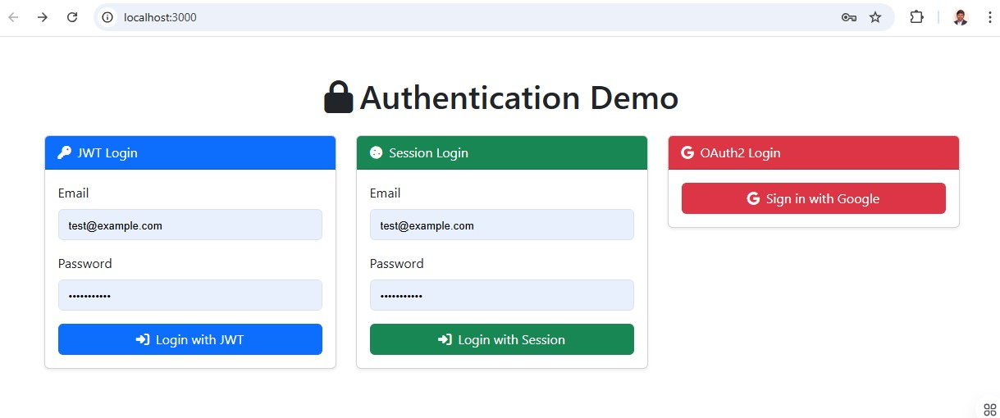

# Authentication & Authorization App
 


A full-stack authentication demo application using **React**, **Express.js**, and **Passport.js**. This project demonstrates multiple authentication strategies:

- **JWT Authentication**
- **Session Authentication**
- **OAuth2 Authentication with Google**

UI is styled using **Bootstrap 5.3.3** and **Font Awesome 6.5.0**.

---

## Project Structure

```
authentication-app/
├── client/         # React frontend (manual setup)
├── server/         # Express backend with Passport strategies
├── .env            # Environment variables for server
├── README.md       # Project documentation
```

---

## Getting Started

### 1. Clone the Repository

```bash
git clone https://github.com/your-username/authentication-app.git
cd authentication-app
```

---

### 2. Setup the Server

```bash
cd server
npm install
```

Create a `.env` file in the `server/` folder with the following:

```env
PORT=5000
SESSION_SECRET=session_secret
GOOGLE_CLIENT_ID=your_google_client_id
GOOGLE_CLIENT_SECRET=your_google_client_secret
```

Start the server:

```bash
node index.js
```

---

### 3. Setup the Client

```bash
cd ../client
npm install
npm start
```

---

## Authentication Methods

### 1. JWT Auth
- Login with email and password
- Returns a JWT token to the client
- Token is stored in client and used for protected API calls

### 2. Session Auth
- Session stored on the server using `express-session`
- Cookie is used to maintain session state

### 3. Google OAuth2
- User signs in with Google
- Redirect handled by Passport Google Strategy
- On success, user is redirected to dashboard

---

## Sample User Credentials

```txt
Email: test@example.com
Password: password123
```

*(Stored in a mock array for demonstration purposes)*

---

## Environment Setup

- Google OAuth must be configured in [Google Cloud Console](https://console.cloud.google.com/):
  - Enable OAuth2 credentials
  - Set redirect URI to: `http://localhost:5000/auth/google/callback`
  - Add JavaScript origin: `http://localhost:3000`

---

## Tech Stack

- **Frontend:** React, Bootstrap 5, Font Awesome
- **Backend:** Node.js, Express.js
- **Auth Libraries:** Passport.js with JWT, Session, and Google Strategies
- **Other:** dotenv, cors, axios

---

## License

This project is licensed under the MIT License.

